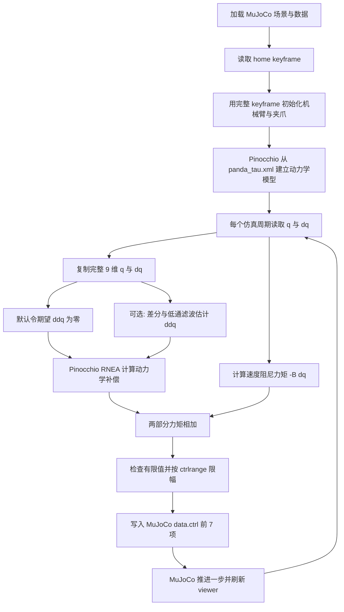

# `panda_dynamics_drag.py` 详细讲解

本文解释 [`demos/panda_dynamics_drag.py`](../demos/panda_dynamics_drag.py) 的设计目的、运行流程、控制公式，以及它背后的机器人学知识。本文以当前仓库中的代码和模型为准，而不是泛泛介绍“拖动示教”。

## 1. 这个示例到底想做什么

一句话概括：

> 这个示例在 MuJoCo 中对 Franka Emika Panda 机械臂施加“逆动力学补偿 + 关节速度阻尼”力矩，使机械臂能够被外力拖动，同时在运动后快速消耗动能。

它主要展示以下内容：

1. 从 MuJoCo 读取机械臂的关节位置和关节速度。
2. 使用 Pinocchio 的 RNEA 算法补偿重力和速度相关动力学。
3. 可选地通过经过低通滤波的速度差分加速度补偿惯性项。
4. 额外施加与关节速度方向相反的阻尼力矩。
5. 把最终力矩送入 MuJoCo 的 7 个关节力矩执行器。
6. 对异常值和超出执行器范围的力矩进行保护。
7. 记录动力学、阻尼和实际施加力矩，关闭 viewer 后自动画图。

它不是一个关节位置控制器，因为代码中没有目标关节角 `q_desired`；它也不是严格意义上的笛卡尔阻抗控制器，因为没有末端目标位姿、末端刚度矩阵或 Jacobian 转置。它更接近一个用于理解拖动行为的“动力学补偿 + 速度阻尼”实验。

## 2. 运行方式与涉及的文件

请从仓库根目录运行：

```bash
source .venv/bin/activate
python -m demos.panda_dynamics_drag
```

涉及的主要文件如下：

| 文件 | 作用 |
|:---:|:---:|
| `demos/panda_dynamics_drag.py` | 控制器与数据记录逻辑 |
| `src/mujoco_viewer.py` | 创建 MuJoCo viewer、推进仿真、调用控制回调 |
| `model/franka_emika_panda/scene_tau.xml` | 仿真场景、地面、灯光和 Panda 模型入口 |
| `model/franka_emika_panda/panda_tau.xml` | Panda 刚体、关节、惯性、碰撞体、力矩执行器和初始姿态 |

这个示例只需要普通 Pinocchio：

```python
import pinocchio as pin
```

它没有使用：

```python
from pinocchio import casadi
```

因此运行本示例不需要执行源码编译版 `scripts/install_pinocchio.sh`。

## 3. 整体控制流程



`CustomViewer.run_loop()` 中一次循环的实际顺序是：

```text

mj_forward
    ↓
runFunc：读取状态并计算当前控制力矩
    ↓
mj_step：使用该控制输入推进一个仿真步
    ↓
viewer.sync
    ↓
sleep(timestep)
```

当前模型的仿真步长是：

```text
dt = 0.002 s
```

对应理想仿真控制频率：

```text
1 / 0.002 = 500 Hz
```

但这不表示程序在现实时间中一定达到 500 Hz，因为动力学计算、终端打印、渲染和 `sleep` 都需要额外时间。当前循环的实际墙钟频率通常低于 500 Hz。

## 4. MuJoCo 模型中的机器人状态

当前 Panda 模型包含 9 个广义坐标：

```text
nq = 9
nv = 9
nu = 8
```

含义如下：

| 索引 | 关节 | 类型 | 是否由本示例控制 |
|:---:|:---:|:---:|:---:|
| 0 | `joint1` | 旋转关节 | 是 |
| 1 | `joint2` | 旋转关节 | 是 |
| 2 | `joint3` | 旋转关节 | 是 |
| 3 | `joint4` | 旋转关节 | 是 |
| 4 | `joint5` | 旋转关节 | 是 |
| 5 | `joint6` | 旋转关节 | 是 |
| 6 | `joint7` | 旋转关节 | 是 |
| 7 | `finger_joint1` | 夹爪滑动关节 | 否 |
| 8 | `finger_joint2` | 夹爪滑动关节 | 否 |

8 个执行器中，前 7 个是机械臂关节力矩执行器，最后一个是夹爪 tendon 执行器：

```text
joint1_tau ... joint7_tau
actuator8
```

前 7 个执行器的控制范围在 XML 中设置为：

```text
-100 <= ctrl[i] <= 100
```

对于 motor actuator，控制量在这里可以理解为广义驱动力矩，单位是 `N·m`。MuJoCo 会根据 `ctrlrange` 对输入进行限制，但代码本身没有在写入 `data.ctrl` 前显式裁剪或报警。

模型还为每个自由度配置了：

```text
joint damping = 1
armature = 0.1
gravity = [0, 0, -9.81] m/s²
integrator = implicitfast
```

因此 MuJoCo 模型内部本来就存在每个关节的被动阻尼；代码又额外施加了较大的控制阻尼，这一点后面会详细讨论。

## 5. 初始化：为什么从 keyframe 读取姿态

构造函数首先调用父类：

```python
super().__init__(scene_xml, 3, azimuth=-45, elevation=-30)
```

父类会：

1. 从 `scene_tau.xml` 创建 `mujoco.MjModel`。
2. 创建对应的 `mujoco.MjData`。
3. 设置 viewer 的距离、方位角和俯仰角。

接着代码读取模型的第一个 keyframe：

```python
self.data.qpos[:] = self.model.key_qpos[0]
self.data.qvel[:] = 0.0
self.data.ctrl[7:] = self.model.key_ctrl[0, 7:]
```

XML 中 `home` keyframe 的完整位置是：

```text
[0, 0, 0, -1.57079, 0, 3.0, -1.7853, 0.04, 0.04]
```

前 7 项是 Panda 机械臂关节角，单位为弧度；最后两项是夹爪滑动关节位置，单位为米。

优化后的代码复制完整的 9 维 keyframe，所以机械臂与夹爪都从模型定义的 `home` 状态开始。所有关节速度都显式清零，夹爪执行器则使用 keyframe 中的控制值。前 7 个力矩执行器没有复制 `key_ctrl`，因为该 keyframe 中的前 7 项来自另一种控制语义，不应直接当成关节力矩。

## 6. `runBefore()`：建立第二套动力学模型

viewer 启动后、控制循环开始前，会调用：

```python
def runBefore(self):
    self.pin_model = pin.RobotWrapper.BuildFromMJCF(self.arm_xml).model
    self.pin_data = self.pin_model.createData()
    self.last_qvel = self.data.qvel.copy()
    self.filtered_qacc = np.zeros(self.model.nv)
```

这里形成了两套用途不同的模型：

| 模型 | 主要职责 |
|:---:|:---:|
| MuJoCo model/data | 数值积分、接触、外力、执行器和可视化 |
| Pinocchio model/data | 刚体运动学和逆动力学计算 |

两者都来自同一个 `panda_tau.xml`，这是很重要的设计：只有当关节顺序、坐标轴、质量、质心、惯性和重力定义一致时，Pinocchio 算出的补偿力矩才有机会与 MuJoCo 中的机器人匹配。

`pin_data` 是 Pinocchio 算法使用的工作区。把它提前创建并复用，可以避免每个周期反复分配大量临时数据。

代码还会校验 MuJoCo 与 Pinocchio 的 `nq`、`nv` 是否一致，避免关节数或排列不匹配时继续输出错误力矩。`last_qvel` 和 `filtered_qacc` 只用于可选的惯性补偿模式。

## 7. 关节状态：`q`、`qvel` 与 `qacc`

每次调用 `runFunc()` 时，代码复制 MuJoCo 的完整状态：

```python
q = self.data.qpos.copy()
qvel = self.data.qvel.copy()
```

| 变量 | 数学符号 | 维度 | 单位 |
|:---:|:---:|:---:|:---:|
| `q` | \(q\) | 9 | 前 7 项 rad，后 2 项 m |
| `qvel` | \(\dot q\) | 9 | 前 7 项 rad/s，后 2 项 m/s |
| `desired_qacc` | \(\ddot q_d\) | 9 | 前 7 项 rad/s²，后 2 项 m/s² |

使用 `copy()` 是为了取得当前周期的独立快照，避免后续 `mj_step()` 更新 MuJoCo 底层数组时影响本次控制计算。

默认配置为：

```python
compensate_inertia=False
```

因此传给 RNEA 的期望加速度是全零：

```python
desired_qacc = np.zeros(self.model.nv)
```

这时控制器主要补偿重力、科氏力和离心力，不主动抵消机械臂惯性，拖动行为更稳定也更容易解释。

### 可选的加速度估计与滤波

当 `compensate_inertia=True` 时，程序使用一阶后向差分估计加速度：

\[
\ddot q_k^{raw} \approx \frac{\dot q_k-\dot q_{k-1}}{\Delta t}
\]

然后使用一阶低通滤波：

\[
\ddot q_k^{filtered}=\alpha\ddot q_k^{raw}+(1-\alpha)\ddot q_{k-1}^{filtered}
\]

默认 `alpha=0.1`。较小的 `alpha` 会让曲线更平滑，但增加延迟。即使经过滤波，差分加速度仍然比零加速度补偿更敏感，因此只建议把它作为对比实验。

## 8. 为什么直接读取完整 9 维状态

Pinocchio 从完整 MJCF 建立的模型拥有 9 个位置和 9 个速度自由度，`pin.rnea()` 要求输入维度与模型一致。优化后的代码直接读取 MuJoCo 的完整状态，不再人为给夹爪补两个零。

这样有两个好处：

1. Pinocchio 可以使用夹爪的真实位置和速度计算整机动力学。
2. 不会出现 MuJoCo 中夹爪为 `0.04 m`、Pinocchio 中却假定为 `0 m` 的状态偏差。

虽然最终仍然只控制前 7 个机械臂关节，但动力学计算使用完整机器人状态。

## 9. RNEA 逆动力学

核心计算是：

```python
dynamics_tau_nm = pin.rnea(
    self.pin_model,
    self.pin_data,
    q,
    qvel,
    desired_qacc,
)
```

RNEA 是 Recursive Newton-Euler Algorithm，即递归牛顿—欧拉算法。它解决的是逆动力学问题：

> 已知机器人当前的关节位置、速度和希望实现的加速度，求产生该运动所需的关节广义力。

机械臂的经典刚体动力学方程可以写为：

\[
M(q)\ddot q + C(q,\dot q)\dot q + g(q) = \tau + \tau_{ext}
\]

也常把科氏力、离心力和重力合并为非线性项：

\[
M(q)\ddot q + h(q,\dot q) = \tau + \tau_{ext}
\]

Pinocchio RNEA 返回的结果近似为：

\[
\tau_{dyn} = M(q)\ddot q + h(q,\dot q)
\]

其中包含：

- 惯性项 \(M(q)\ddot q\)；
- 科氏力与离心力；
- 重力项 \(g(q)\)。

默认 `desired_qacc` 为零，所以 `dynamics_tau_nm` 主要包含重力、科氏力和离心力补偿。只有启用 `compensate_inertia` 时，它才会包含由滤波加速度估计产生的惯性补偿项。

### 如果把 `a` 改成零会怎样

优化后的默认配置就是令期望加速度为零：

```python
compensate_inertia=False
```

若真正令 \(\ddot q=0\)，则 RNEA 近似变为：

\[
\tau_{dyn} = C(q,\dot q)\dot q + g(q)
\]

机械臂静止时 \(\dot q=0\)，进一步近似为：

\[
\tau_{dyn}=g(q)
\]

这就是常见的重力补偿。它让机械臂不容易因为自身重量下落，同时不主动要求机械臂回到某个目标位置。

如果把 `compensate_inertia` 改为 `True`，控制器会使用滤波后的 \(\ddot q\) 估计补偿惯性项，让外部拖动时呈现更低的表观惯性，但对模型误差、采样延迟和加速度噪声也会更加敏感。

## 10. 速度阻尼控制

代码定义：

```python
damping_nm_s_rad = 10.0
damping_tau_nm = -damping_nm_s_rad * arm_qvel_rad_s
```

等价于：

\[
\tau_d = -B\dot q
\]

其中：

\[
B=10
\]

阻尼力矩总是与运动方向相反：

- 当关节速度为正时，阻尼力矩为负；
- 当关节速度为负时，阻尼力矩为正；
- 当关节速度为零时，阻尼力矩为零。

若把每个关节看成旋转系统，阻尼系数单位可理解为：

```text
N·m·s/rad
```

从功率角度可以看到它为什么耗散能量：

\[
P_d = \tau_d^T\dot q
    = (-B\dot q)^T\dot q
    = -\dot q^T B\dot q \le 0
\]

只要 \(B\) 是正半定的，阻尼项不会主动向系统持续注入能量，而是消耗机械能。这是机器人柔顺控制和稳定性分析中的重要思想。

代码把阻尼系数保存为正数，再在控制律中显式添加负号：

```python
damping_nm_s_rad = 10.0
damping_tau_nm = -damping_nm_s_rad * qvel_rad_s
```

## 11. 最终控制律

最终力矩由两部分相加：

```python
requested_tau_nm = dynamics_tau_nm[:ARM_DOF] + damping_tau_nm
applied_tau_nm, saturated = self._clip_arm_torque(requested_tau_nm)
```

数学表达式为：

\[
\tau_{cmd}
= C(q,\dot q)\dot q
+ g(q)
- B\dot q
\]

当 `compensate_inertia=True` 时，公式中才额外包含 \(M(q)\ddot q_{est}\)。

然后只把前 7 项写给机械臂关节执行器：

```python
self.data.ctrl[:ARM_DOF] = applied_tau_nm
```

写入前会检查所有值是否有限，并根据 MJCF 中前 7 个 actuator 的 `ctrlrange` 显式限幅。夹爪执行器不在控制循环中更新，保持初始化时的 keyframe 控制值。

### 直观理解

- `dynamics_tau_nm`：默认抵消机器人本身的重力和速度相关力；可选补偿惯性力矩。
- `damping_tau_nm`：抵抗关节运动，防止松手后持续摆动或速度过高。
- 外部拖动力：来自用户在仿真 viewer 中施加的扰动或操作。

这三者共同决定实际运动。

## 12. 为什么它不是真正的“位置保持”

常见关节阻抗控制器为：

\[
\tau = g(q) + K(q_d-q) - D\dot q
\]

其中 \(K(q_d-q)\) 是弹簧项，会把机器人拉回目标关节位置 \(q_d\)。

当前示例没有：

- `q_desired`；
- 位置误差；
- 刚度矩阵 `K`。

因此它没有明确的“回到初始姿态”目标。松手后的行为由重力补偿精度、阻尼、模型误差、接触和数值积分共同决定。

这正是拖动/零力控制与位置保持之间的核心区别：

| 控制形式 | 是否有目标位置 | 典型手感 |
|:---:|:---:|:---:|
| 重力补偿 | 否 | 可以移动，理想情况下松手停在附近 |
| 重力补偿 + 阻尼 | 否 | 可以移动，运动会被抑制 |
| 位置 PD + 重力补偿 | 是 | 像弹簧一样被拉回目标 |
| 笛卡尔阻抗 | 有末端目标 | 末端在任务空间呈现弹簧阻尼行为 |

## 13. 为什么“拖动”需要动力学补偿

如果完全不给关节力矩，Panda 会受重力作用下落。用户拖动时，不仅要克服机械臂惯性，还要持续对抗各连杆重力。

加入重力与动力学补偿后，控制器承担了机器人自身动力学负担，用户施加的外力主要用于改变运动状态，因此会感觉更容易移动。

真实协作机器人中的拖动示教通常还会使用：

- 关节力矩传感器；
- 电机电流估计；
- 外力/外力矩观测器；
- 摩擦补偿；
- 碰撞检测；
- 速度、位置和力矩限制；
- 急停与安全状态机；
- 笛卡尔或零空间约束。

当前示例没有这些完整的安全机制，所以只能视为仿真教学代码。

## 14. MuJoCo 被动阻尼与代码阻尼

`panda_tau.xml` 已经为关节设置：

```xml
<joint armature="0.1" damping="1" .../>
```

MuJoCo 会把该被动阻尼计入内部动力学。控制代码又添加：

```text
B = 10
```

因此系统同时包含：

1. MuJoCo 模型内部约为 `1` 的关节被动阻尼；
2. 控制器默认施加的 `10` 速度反馈阻尼。

优化后的默认值比原来的 `100` 更容易拖动，但仍明显大于模型被动阻尼。阻尼过大仍可能导致：

- 机械臂很难拖动；
- 控制力矩频繁触及 ±100 限制；
- 离散时间下产生抖动；
- 数值加速度噪声与力矩饱和相互作用；
- 表面上“稳定”，但其实只是运动被强烈压制。

可以通过构造参数 `damping_nm_s_rad` 尝试 5、10 或 20，并观察速度衰减、拖动手感和力矩饱和情况。

## 15. 数据记录和画图

每个周期会保存：

```python
self.time_s_history.append(float(self.data.time))
self.dynamics_tau_nm_history.append(dynamics_tau_nm[:7].copy())
self.damping_tau_nm_history.append(damping_tau_nm.copy())
self.applied_tau_nm_history.append(applied_tau_nm.copy())
```

`plot_torques()` 为每个关节画三条曲线：

- 蓝线：Pinocchio RNEA 返回的逆动力学力矩；
- 红线：速度阻尼力矩。
- 绿线：经过限幅后实际写入 actuator 的总力矩。

横轴直接使用 MuJoCo 的仿真时间 `data.time`，单位是秒。关节标签从 MuJoCo 模型读取，不再手写，因此不会再出现漏掉 `joint3`、误写成 `j8` 的问题。viewer 正常关闭后，`main()` 会统一调用一次 `plot_torques()`。

四组历史数据使用带 `maxlen=100_000` 的 `deque`，最多保留约 200 秒的 500 Hz 样本，避免长时间运行时内存无限增长。

## 16. 终端输出代表什么

默认每 100 个仿真步打印一次：

```python
if self.step_index % self.print_interval_steps == 0:
    print(f"applied τ={applied_tau_nm} N·m")
```

`applied τ` 是经过显式限幅、最终送给前 7 个 actuator 的控制命令。如果请求力矩超出范围，日志会附加 `[SATURATED]`。100 步对应约 0.2 秒仿真时间，这样既能观察控制状态，也不会让终端 I/O 主导仿真循环。

## 17. 这个示例用到的机器人学知识

### 17.1 广义坐标

机器人不是直接以每个连杆的笛卡尔位置作为控制状态，而是以关节坐标 \(q\) 描述构型。Panda 的机械臂部分有 7 个旋转自由度，因此：

\[
q\in\mathbb{R}^7
\]

7 自由度机械臂相对于一般 6 维末端任务具有一个冗余自由度，可以在保持末端任务的同时调整肘部姿态。不过当前示例没有使用 Jacobian 或零空间控制。

### 17.2 刚体动力学

每根连杆的质量、质心和转动惯量共同决定 \(M(q)\)、\(C(q,\dot q)\) 和 \(g(q)\)。机械臂姿态改变时，重力力矩和惯性耦合也会改变。

### 17.3 正动力学与逆动力学

- 正动力学：给定当前状态和力矩，求加速度。
- 逆动力学：给定当前状态和期望加速度，求力矩。

MuJoCo 在 `mj_step()` 中主要完成正动力学和数值积分；Pinocchio 的 `rnea()` 在这里完成逆动力学。

### 17.4 递归牛顿—欧拉算法

RNEA 使用沿运动链向外和向内的递归，高效计算关节力矩。其复杂度随关节数量近似线性增长，适合机器人实时控制中的逆动力学计算。

### 17.5 数值微分

可选惯性补偿模式通过相邻速度样本估算加速度。这个方法简单但会放大噪声，因此代码增加了一阶低通滤波，并且默认关闭惯性补偿。

### 17.6 阻尼与能量耗散

`-B qvel` 是典型粘性阻尼模型。它通过产生负机械功率消耗系统动能，是阻抗控制、柔顺控制和被动性分析的重要组成部分。

### 17.7 力矩控制

位置执行器通常接收目标位置，而这里的 motor actuator 接收的是力矩控制量。力矩控制更接近机器人动力学本身，但也要求更严格的模型、限幅、稳定性和安全保护。

### 17.8 模型补偿

控制器依赖 Pinocchio 与 MuJoCo 模型匹配。质量、惯量、摩擦、关节顺序或重力方向不一致都会形成补偿误差。真实机器人中还会有减速器摩擦、线缆力、温度变化和负载变化。

### 17.9 柔顺控制

柔顺不是简单地“把增益调小”。它涉及外力如何改变机器人运动，以及控制器是否稳定地吸收或释放能量。当前示例通过动力学补偿降低自身负担，通过阻尼抑制运动，但没有显式估计外力。

## 18. 当前实现中值得特别注意的问题

### 18.1 加速度反馈可能使系统敏感

当 `compensate_inertia=True` 时，RNEA 使用经过低通滤波的速度差分加速度，再把对应惯性力矩反馈给同一个系统。这会近似降低机器人的表观惯性，但仍可能放大噪声、延迟和模型误差。

因此默认配置为：

```python
compensate_inertia=False
```

先观察“重力/速度项补偿 + 阻尼”，确认稳定后再把惯性补偿作为对比实验。

### 18.2 当前已有的数值与力矩保护

优化后的代码已经加入：

- MuJoCo/Pinocchio 状态维度校验；
- actuator 数量和 `ctrlrange` 校验；
- `NaN`/`Inf` 检测，异常时先把控制力矩清零再终止；
- 根据每个 actuator 的 `ctrlrange` 执行 `np.clip`；
- 日志中的 `[SATURATED]` 饱和提示。

这些保护能让仿真失败更容易定位，但仍不能替代真实机器人的安全控制系统。

### 18.3 不是实机安全控制器

该示例缺少真实机器人必须具备的安全层，例如：

- 硬件急停；
- 通信看门狗；
- 关节位置软限位；
- 关节速度限制；
- 关节力矩和力矩变化率限制；
- 碰撞检测；
- 控制周期超时处理；
- 传感器故障检测；
- 安全降级状态。

不要把 `data.ctrl[:ARM_DOF] = applied_tau_nm` 机械替换成真实机器人发送接口。

### 18.4 两套模型仍可能存在动力学差异

即使两者读取同一 MJCF，MuJoCo 与 Pinocchio 对以下因素的处理仍可能不同：

- actuator 动力学；
- armature；
- 被动阻尼；
- 摩擦；
- 接触约束；
- tendon 与 equality constraint；
- 数值积分器。

Pinocchio RNEA 主要计算理想刚体链的逆动力学，不会自动复现 MuJoCo 的全部执行器、接触和约束行为。

### 18.5 历史数据只保留固定长度

四组历史数据使用 `deque(maxlen=100_000)`，在 500 Hz 下约保留最近 200 秒。更早的数据会自动丢弃，因此内存占用有上限；如果需要完整长时间记录，仍应降低采样频率或流式写盘。

### 18.6 控制循环不是真正的硬实时循环

Python、viewer、终端打印和 `time.sleep()` 都不能保证严格的 2 ms 周期。这个示例适合仿真学习，不适合用来证明真实机器人控制器满足实时性要求。

## 19. 建议的学习实验顺序

为了理解每个控制项的作用，可以按以下顺序实验。每次只改变一个因素，并观察关节速度与力矩曲线。

### 实验一：只有 MuJoCo 被动动力学

暂时令：

```python
tau = np.zeros(9)
```

观察机械臂如何受重力下落。这是没有动力学补偿的基线。

### 实验二：只做重力补偿

使用：

```python
v_for_rnea = np.zeros(9)
a_for_rnea = np.zeros(9)
dynamics_tau = pin.rnea(model, data, q, v_for_rnea, a_for_rnea)
tau = dynamics_tau
```

观察机器人是否能大致抵消自身重量。

### 实验三：重力补偿加不同阻尼

依次尝试：

```text
B = 5, 10, 20, 50, 100
```

比较拖动所需外力、松手后的速度衰减和控制力矩饱和情况。

### 实验四：加入速度相关动力学

向 RNEA 传入真实 `v`，但保持 `a=0`，观察快速运动时科氏力和离心力补偿的影响。

### 实验五：加入加速度估计

把构造参数改成 `compensate_inertia=True`，比较力矩曲线的噪声和机械臂表观惯性变化；再调整 `acceleration_filter_alpha`，观察平滑程度与延迟之间的权衡。

### 实验六：加入位置刚度

增加：

\[
\tau_k=K(q_d-q)
\]

即可从纯阻尼/动力学补偿逐步过渡到关节空间阻抗控制，并直观感受“零刚度”和“有限刚度”的区别。

## 20. 优化后的控制框架

当前实现的核心逻辑可以简化为下面的伪代码：

```python
q_full = data.qpos.copy()
dq_full = data.qvel.copy()

if compensate_inertia:
    ddq_desired = low_pass_filter((dq_full - last_dq_full) / dt)
else:
    ddq_desired = np.zeros(model.nv)

tau_inverse_dynamics = pin.rnea(
    pin_model, pin_data, q_full, dq_full, ddq_desired
)
tau_damping = -damping * dq_full[:7]
tau_requested = tau_inverse_dynamics[:7] + tau_damping

if not np.all(np.isfinite(tau_requested)):
    data.ctrl[:7] = 0.0
    raise FloatingPointError("non-finite torque command")

tau_command = np.clip(tau_requested, torque_min, torque_max)
data.ctrl[:7] = tau_command
```

优化后的代码明确表达了以下工程意图：

- 明确复制仿真状态；
- 使用真实的完整夹爪状态；
- 默认使用零期望加速度，并把滤波惯性补偿作为可选实验；
- 检查非有限数值；
- 显式限制力矩；
- 区分 requested torque 与 applied torque。

## 21. 常见问题

### 为什么普通 `import pinocchio as pin` 就够了？

因为本示例只调用数值版 `pin.rnea()`，没有构造 CasADi 符号变量，也没有调用 `pinocchio.casadi`。PyPI/uv 安装的普通 `pin` 包即可提供此功能。

### 为什么不直接使用 MuJoCo 自己的逆动力学？

MuJoCo 也提供逆动力学相关能力。这里使用 Pinocchio 的目的主要是展示机器人学库之间的组合：MuJoCo 负责仿真，Pinocchio 负责刚体算法。这样也方便与未来真实机器人控制或其他仿真器中的 Pinocchio 模型复用。

### `dynamics_tau` 是实际传感器测得的力矩吗？

不是。它是 Pinocchio 根据模型和 `q/v/a` 计算出的理论逆动力学力矩。

### `data.ctrl` 是实际产生的关节力矩吗？

它是执行器控制输入。实际广义力还会受到 actuator 模型、控制范围、约束、接触和 MuJoCo 内部动力学影响。需要查看 `qfrc_actuator` 等量才能分析 MuJoCo 最终施加的广义执行器力。

### 为什么松手后不一定完全停在原地？

因为没有位置刚度。阻尼只反对速度，不会主动消除位置误差；模型补偿误差、接触和力矩饱和也会产生缓慢漂移。

### 这个程序是在做导纳控制吗？

它没有显式使用外力测量和目标质量—阻尼—刚度方程，因此不属于完整的标准导纳控制。它可以呈现某种可拖动的柔顺效果，但更准确的描述是逆动力学补偿加关节阻尼。

### 能直接用于真实 Panda 吗？

不能。该代码没有真实机器人接口、实时控制保证和必要安全机制；模型中的统一 ±100 控制范围也不代表真实 Panda 各关节的安全力矩限制。

## 22. 总结

这个示例最值得学习的不是某一个 API，而是以下控制链路：

```text
仿真状态
→ 默认设置零期望加速度
→ Pinocchio 计算重力和速度相关动力学补偿
→ 速度阻尼耗能
→ 数值检查与执行器范围限幅
→ MuJoCo 力矩执行器
→ 新的机器人状态
```

它把 MuJoCo 与 Pinocchio 连接起来，直观展示了机器人刚体动力学、逆动力学、力矩控制、阻尼耗能和拖动柔顺性的关系。

同时应牢记：当前实现仍是教学实验，不是完整的拖动示教控制器。优化加入了模型维度校验、滤波、显式力矩限幅、有限值检查和有界历史记录，但真实机器人所需的硬实时控制、急停、速度限制、力矩变化率限制和故障状态机仍不在本示例范围内。
